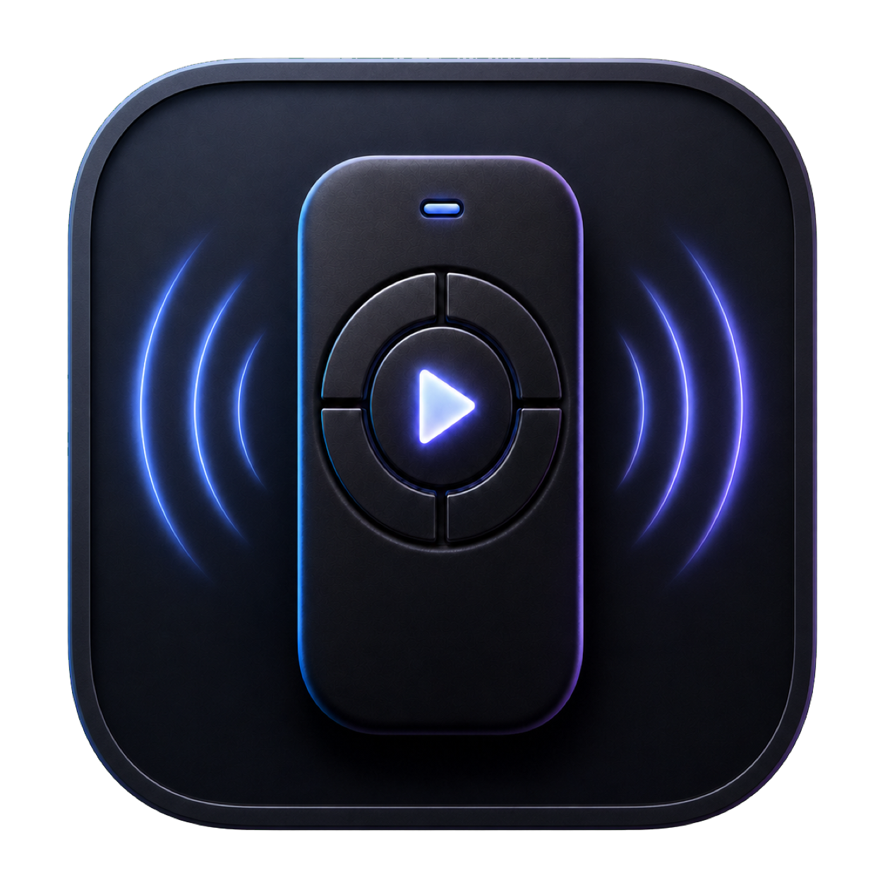
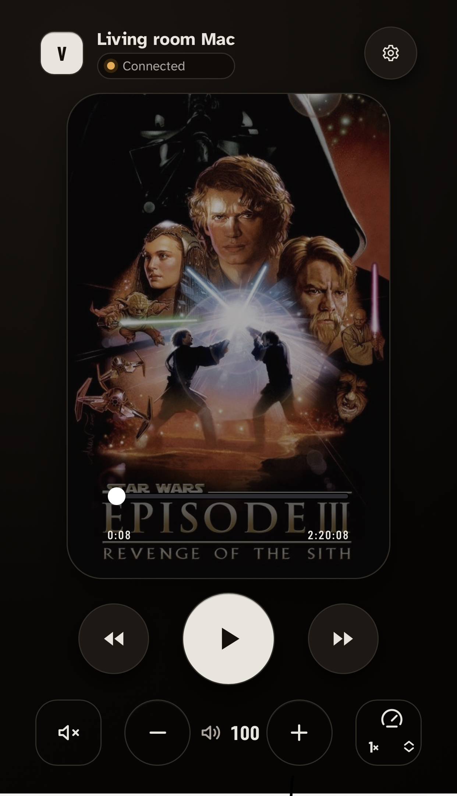
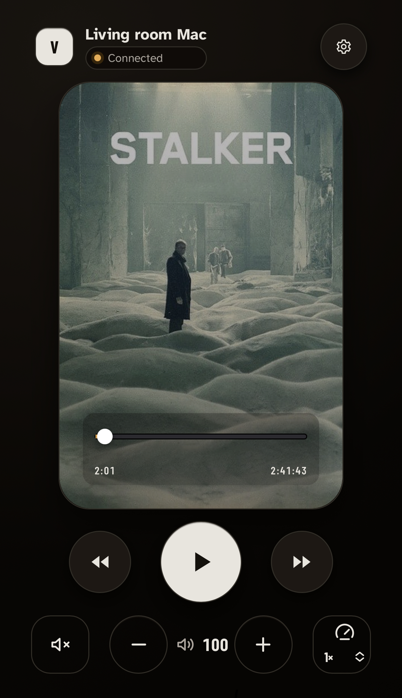
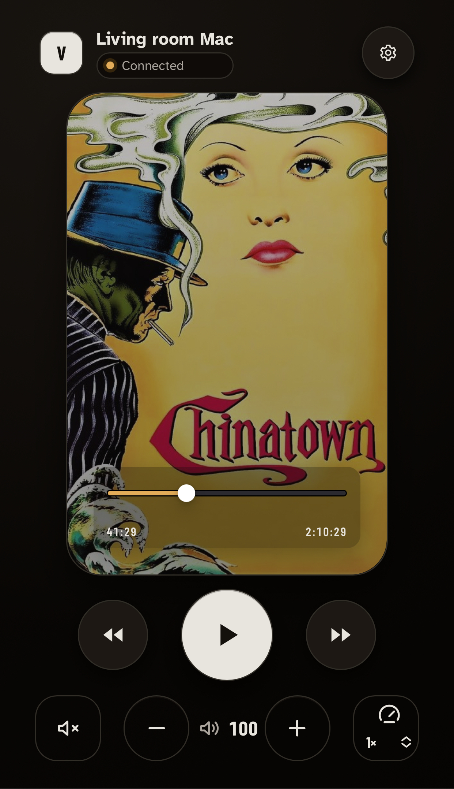

# VLC Remote

A local, mobile-first remote for VLC on macOS. Open the remote on a phone,
scan one QR code, and control VLC from the same home network.

<p align="center">
  
</p>

## What it does

- Pairs a phone to one Mac with a QR code.
- Controls play/pause, ±10-second seek, timeline seek, volume (0–200), mute,
  and playback speed.
- Shows a movie poster while media is playing, using TMDB when configured.
- Lets a paired phone choose a movie from `Desktop/Movies`, loading local
  sidecar subtitles and entering fullscreen.
- Runs as an installable phone web app and an optional Mac Dock app.
- Keeps VLC's HTTP password on the Mac. The phone never receives it.

```text
Phone browser or PWA → FastAPI on the Mac → VLC HTTP on 127.0.0.1
```

## Screenshots

<p align="center">
  
  
  
</p>

Future real-device screenshots belong in [`docs/screenshots`](docs/screenshots).
Never include a pairing URL or token in a screenshot.

## Requirements

- macOS with VLC 3.x
- Python 3.11+
- Node.js 22+
- npm 10+

## Quick start

```bash
make bootstrap
make vlc-http
make run
```

Scan the QR code from a phone on the same private Wi-Fi. `make vlc-http` starts
VLC with a loopback-only HTTP override and does not change saved VLC
preferences. `make run` serves the React app and API together on port 8000.

To show a fresh QR without restarting the service:

```bash
make pairing
```

## Movie library

Put movies anywhere inside `~/Desktop/Movies`; each movie may live in its own
named folder. Tap the poster/touch surface to open the picker, then tap a poster
to play it. The same picker is available in
**Settings → Movie library**.

The phone receives only opaque IDs and display metadata. The Mac re-scans and
validates each selection inside `Desktop/Movies` before VLC is asked to open it.
Compatible subtitle files directly beside the selected movie (`.srt`, `.ass`,
`.vtt`, and similar formats) are added to VLC automatically.

## Mac app

Build, install, and open the Dock app:

```bash
make app
```

It installs as **VLC Remote.app** in `/Applications`. On first launch, choose
this project folder. Later launches start the local remote and display its QR
code automatically. Closing the QR window leaves the remote running; quitting
the Dock app stops the remote and asks VLC to quit normally.

## Optional movie posters

Create a local `.env` from `.env.example`, then add a TMDB API Read Access
Token:

```text
TMDB_API_TOKEN=your_token_here
```

The token stays on the Mac. It is never sent to the phone and must never be
committed.

## Development and checks

| Command | Purpose |
| --- | --- |
| `make dev` | Run the development servers |
| `make build` | Build the production frontend |
| `make format` | Format Python source |
| `make lint` | Run Python and frontend linting |
| `make typecheck` | Run Python and TypeScript checks |
| `make test` | Run unit tests |
| `make e2e` | Run iPhone-sized browser tests |
| `make menu-bar-build` | Build the native macOS app bundle |

Run the complete automated suite before a contribution:

```bash
make format
make lint
make typecheck
make test
make e2e
make build
```

## Security

- VLC listens only on `127.0.0.1`; the phone talks only to the Mac-hosted app.
- The pairing token is kept in the URL fragment, then removed before requests.
- The frontend accepts only fixed, typed control actions—never arbitrary VLC
  commands, URLs, shell commands, or AppleScript.
- Movie selections are constrained to files currently inside `Desktop/Movies`.
- This is for a trusted private network. Do not expose port 8000 to the public
  internet.

More detail: [VLC setup](docs/VLC_SETUP.md),
[security](docs/SECURITY.md), and [troubleshooting](docs/TROUBLESHOOTING.md).

## License

[MIT](LICENSE)
